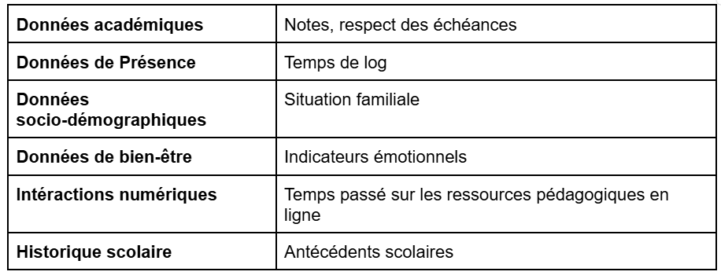

# Budget Buddy

Budget Buddy est une application de gestion financière développée avec `customtkinter` pour l'interface graphique et une base de données MySQL pour le stockage des données. Cette application permet aux utilisateurs de suivre leurs finances, d'ajouter des transactions (dépenses et revenus), et d'afficher des statistiques sous forme de graphiques.

## 🚀 Fonctionnalités

- 🔑 **Authentification sécurisée** (connexion et gestion des utilisateurs)
- 💰 **Gestion des comptes** (suivi des soldes et opérations)
- 📊 **Affichage des transactions** (dépenses et revenus)
- 🔍 **Recherche et tri avancés** des transactions
- 📈 **Tableaux de bord interactifs** avec graphiques et indicateurs financiers
- 🛠 **Personnalisation des catégories** avec icônes monochromes
- 🎨 **Interface zen et épurée**


# Voici les images de mon projet :

## Connexion et Inscription


## Erreurs


## Dashboard


## Comptes et Transactions



## Dépôts, Retraits et Transferts


## Filtrage des Transactions


## Catégories


## Utilisateurs, Catégories et Transactions sur MySQL


## 🛠 Technologies utilisées

- **Python** (3.x)
- **customtkinter** (interface utilisateur)
- **mysql-connector-python** (base de données MySQL)
- **Matplotlib** (graphiques et visualisation)
- **Pillow** (gestion des images et icônes)
- **bcrypt** (hachage des mots de passe pour une sécurité renforcée)

## 📦 Installation

### 1️⃣ Cloner le dépôt

```bash
git clone https://github.com/clarisse-oyharcabal/budget_buddy.git
cd budget_buddy
