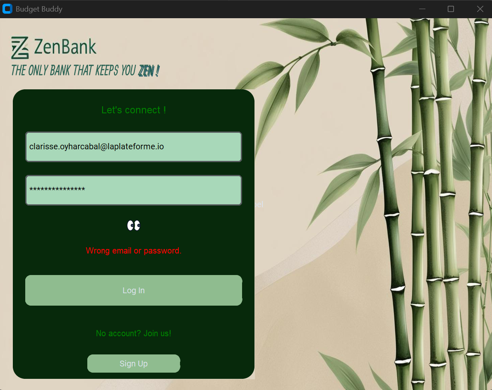

# Budget Buddy

Budget Buddy est une application de gestion financière développée avec `customtkinter` pour l'interface graphique et une base de données `MySQL` pour le stockage des données. Cette application permet aux utilisateurs de suivre leurs finances, d'ajouter des transactions (dépenses et revenus), et d'afficher des statistiques sous forme de graphiques.

## 🚀 Fonctionnalités

- 🔑 **Authentification sécurisée** (connexion et gestion des utilisateurs)
- 💰 **Gestion des comptes** (suivi des soldes et opérations)
- 📊 **Affichage des transactions** (dépenses et revenus)
- 🔍 **Recherche et tri avancés** des transactions
- 📈 **Tableaux de bord interactifs** avec graphiques et indicateurs financiers
- 🎨 **Interface originale, zen et épurée**


# Voici les images de mon projet :

## Connexion et Inscription


## Erreurs (weak password, fields, wrong e-mail format...)




## Hover Effects


## Dashboard


## Comptes et Filtrage des Transactions


## Dépôts, Retraits et Transferts


## Catégories


## Utilisateurs (cryptage mots de passe), Catégories et Transactions sur MySQL


## 🛠 Technologies utilisées

- **Python** (3.x)
- **customtkinter** (interface utilisateur)
- **mysql-connector-python** (base de données MySQL)
- **Matplotlib** (graphiques et visualisation)
- **Pillow** (gestion des images et icônes)
- **bcrypt** (hachage des mots de passe pour une sécurité renforcée)

## 📦 Installation

### 1️⃣ Cloner le dépôt

```bash
git clone https://github.com/clarisse-oyharcabal/budget_buddy.git
cd budget_buddy
